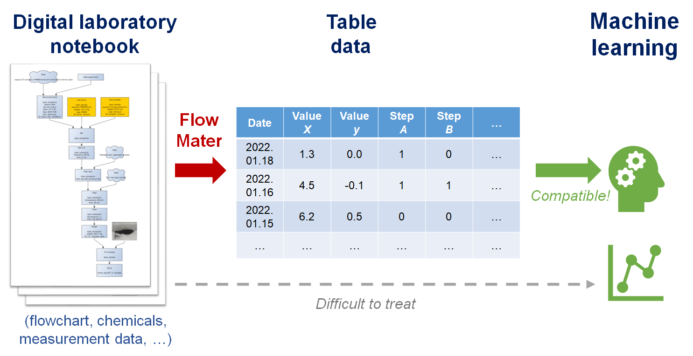

# FlowMater

- Flowchart of Materials

- Python module to convert flowchart-type material data into a table database.
  
  

# About GUI version
 - [GUI version is under development](https://github.com/KanHatakeyama/flowmater3.1)

# How to use

- See tutorial pages

# Requirements

- Check for env. yml

- Main modules
  
  - netrowkX (e.g., 2.5)
  
  - transformers (e.g., 2.1.1) and BERT model (PyTorch or TensorFlow)
  
  - pandas, scikit-learn, matplotlib, etc.
  
  - 

# Note

- Related papers
  - [ChemRxiv](https://doi.org/10.26434/chemrxiv-2022-w1c6h)

# History

- version 2022.1.18: initial version

# TODO

- GUI tool of editing graph and JSON data (in the future)

# Author

- Kan Hatakeyama-Sato
- Waseda University
- https://kanhatakeyama.github.io/
- satokan@toki.waseda.(japan)
